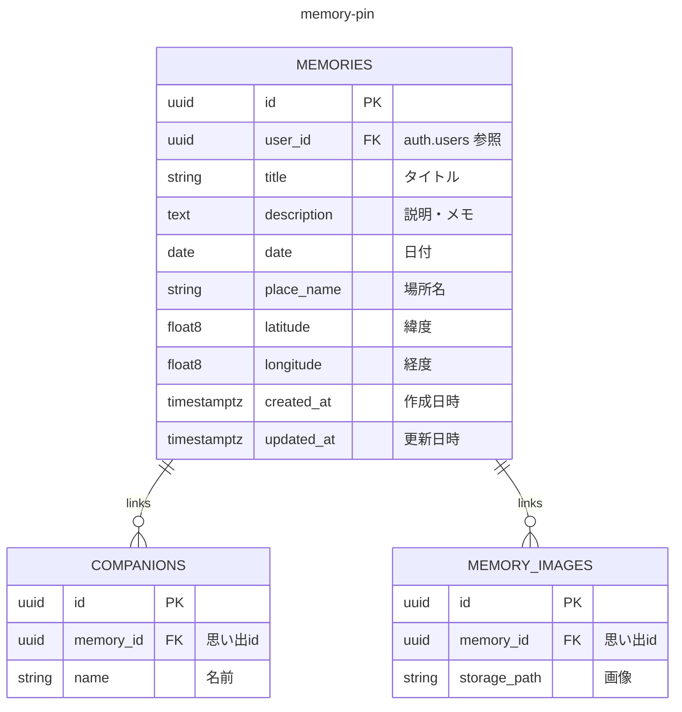

```mermaid
---
title: "memory-pin"
---
erDiagram
    MEMORIES ||--o{ COMPANIONS : links
    MEMORIES ||--o{ MEMORY_IMAGES : links

    COMPANIONS {
        uuid id PK 
        uuid memory_id FK "思い出id"
        string name "名前"
    }

    MEMORIES {
        uuid id PK
        uuid user_id FK  "auth.users 参照"
        string title "タイトル"
        text description "説明・メモ"
        date date "日付"
        string place_name "場所名"
        float8 latitude "緯度"
        float8 longitude "経度"
        timestamptz  created_at "作成日時"
        timestamptz  updated_at "更新日時"
    }

    MEMORY_IMAGES {
        uuid id PK
        uuid memory_id FK "思い出id"
        string storage_path "画像"
    }
```